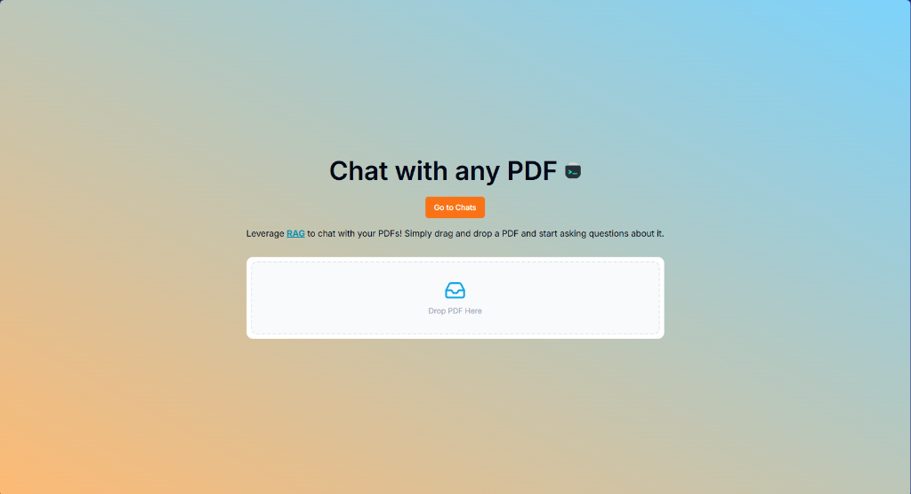
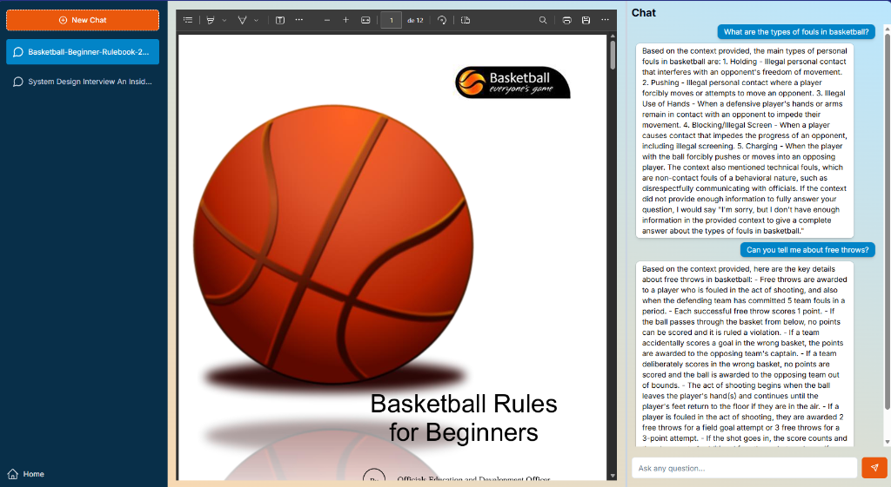

# Chat with Any PDF - AI SDK & RAG

A powerful, full-stack AI application that allows you to upload PDF documents and have intelligent conversations about their content. Leveraging Retrieval-Augmented Generation (RAG) for accurate, context-aware responses.

## 🚀 Screenshots


*Modern, responsive landing page with easy PDF uploads.*


*Interactive chat experience with side-by-side PDF viewing and AI-powered answers.*

## 🛠 Tech Stack

- **Framework**: [Next.js](https://nextjs.org/) (App Router)
- **Authentication**: [Clerk](https://clerk.dev/)
- **Database**: [Supabase](https://supabase.com/) Postgres
- **Vector Storage**: [pgvector](https://github.com/pgvector/pgvector) on Supabase
- **AI Models (via Amazon Bedrock)**:
  - **Embeddings**: `amazon.titan-embed-text-v2:0` (1024 dimensions)
  - **LLM**: `anthropic.claude-3-haiku-20240307-v1:0`
- **ORM**: [Drizzle ORM](https://orm.drizzle.team/)
- **Styling**: [Tailwind CSS](https://tailwindcss.com/)
- **Components**: [Shadcn UI](https://ui.shadcn.com/) & [Lucide React](https://lucide.dev/)

## 🧠 How it Works (RAG Architecture)

This project implements a sophisticated **Retrieval-Augmented Generation (RAG)** pipeline to provide grounded AI responses based on your documents.

1.  **Document Ingestion**: When a PDF is uploaded, the text is extracted and split into meaningful chunks.
2.  **Vector Embeddings**: Each text chunk is processed through the **Amazon Bedrock Titan** model to create a high-dimensional vector representing its semantic meaning.
3.  **Vector Storage**: These embeddings are stored in a **Supabase Postgres** database using the `pgvector` extension.
4.  **Semantic Search**: When you ask a question, the query is converted into an embedding. We then perform a cosine similarity search in the database to retrieve the top-5 most relevant text chunks from your PDF.
5.  **Augmented Response**: The retrieved context is combined with your question and sent to **Claude 3 Haiku** via Amazon Bedrock. The model uses the specific context to answer accurately, ensuring the AI doesn't "hallucinate" information not present in the document.

## ⚙️ Getting Started

### 1. Clone the repository
```bash
git clone https://github.com/PatrickLR7/nextjs-ai-pdf-chat.git
cd nextjs-ai-pdf-chat
```

### 2. Environment Variables
Create a `.env` file based on `.env.example`:

```env
NEXT_PUBLIC_CLERK_PUBLISHED_KEY=
CLERK_SECRET_KEY=

DATABASE_URL=

AWS_REGION=
AWS_ACCESS_KEY_ID=
AWS_SECRET_ACCESS_KEY=
```

### 3. Install dependencies
```bash
npm install
```

### 4. Run migrations
```bash
npm run db:push
```

### 5. Start the development server
```bash
npm run dev
```

## 📜 License
This project is licensed under the MIT License.
